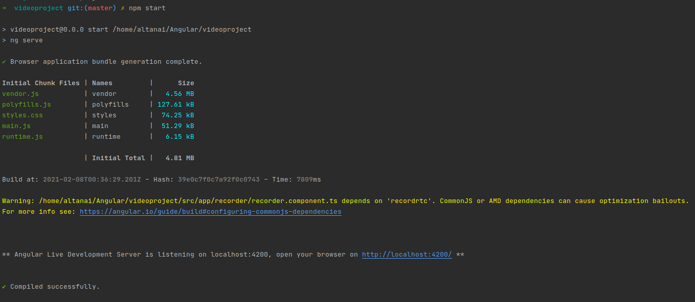
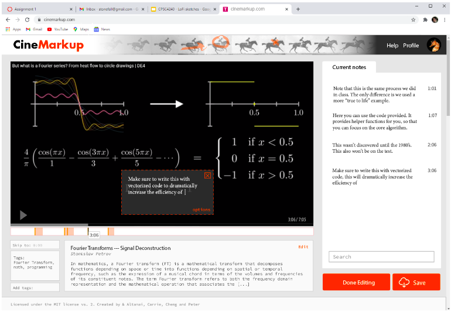
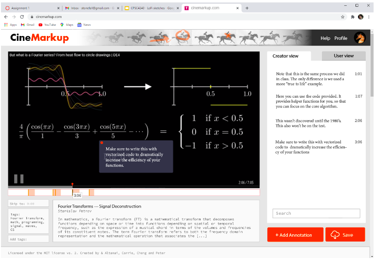

# Videoproject

## features

- MongoDB - document database
- Express(.js) - Node.js web routing framework
- Angular(.js) - a client-side JavaScript framework
- Node(.js) - the premier JavaScript web server

**Notes**

- Step 1) npm install -g @angular/cli
- Step 2) ng new my-angular-project
- Step 3) cd my-angular-project
- Step 4) ng serve --open

## RUN

```shell
npm start
```


Goto http://localhost:4200/

## UI

editor 


player 


## Archive

This project was generated with [Angular CLI](https://github.com/angular/angular-cli) version 11.1.1.


- Development server

Run `ng serve` for a dev server. Navigate to `http://localhost:4200/`. The app will automatically reload if you change any of the source files.

- Code scaffolding

Run `ng generate component component-name` to generate a new component. You can also use `ng generate directive|pipe|service|class|guard|interface|enum|module`.

- ng Build

Run `ng build` to build the project. The build artifacts will be stored in the `dist/` directory. Use the `--prod` flag for a production build.

## Test 

###  Running unit tests

Run `ng test` to execute the unit tests via [Karma](https://karma-runner.github.io).

### Running end-to-end tests

Run `ng e2e` to execute the end-to-end tests via [Protractor](http://www.protractortest.org/).


## References 

- https://angular.io/tutorial 
- To get more help on the Angular CLI use `ng help` or go check out the [Angular CLI Overview and Command Reference](https://angular.io/cli) page.
